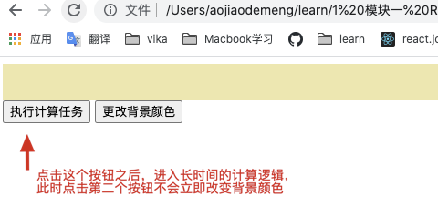

# 一、概述

[requestIdleCallback mdn](https://developer.mozilla.org/zh-CN/docs/Web/API/Window/requestIdleCallback)

# 二、例子

未加入 requestIdleCallback 的卡顿效果：

```javascript
<!DOCTYPE html>
<html lang="en">
  <head>
    <meta charset="UTF-8" />
    <meta name="viewport" content="width=device-width, initial-scale=1.0" />
    <title>Document</title>
    <style>
      #box {
        padding: 20px;
        background: palegoldenrod;
      }
    </style>
  </head>
  <body>
    <div id="box"></div>
    <button id="btn1">执行计算任务</button>
    <button id="btn2">更改背景颜色</button>
    <script>
      var box = document.getElementById("box");
      var btn1 = document.getElementById("btn1");
      var btn2 = document.getElementById("btn2");
      var number = 99999;
      var value = 0;

      function calc() {
        while (number > 0) {
          value = Math.random() < 0.5 ? Math.random() : Math.random();
          console.log(value);
          number--;
        }
      }

      btn1.onclick = function () {
        calc();
      };

      btn2.onclick = function () {
        box.style.background = "green";
      };
    </script>
  </body>
</html>
```



加入 requestIdleCallback 后，点击第二个按钮会立即改变背景颜色:

```javascript
<script>
  function calc() {
  while (number > 0 && deadline.timeRemaining() > 1) {
    value = Math.random() < 0.5 ? Math.random() : Math.random();
    console.log(value);
    number--;
  }
  // 这行代码很重要，如果计算还没完成就被终止了，就需要继续调用，否则终止之后就不会再继续执行
  requestIdleCallback(calc);
}

btn1.onclick = function () {
  requestIdleCallback(calc);
};

btn2.onclick = function () {
  box.style.background = "green";
};
</script>
```
