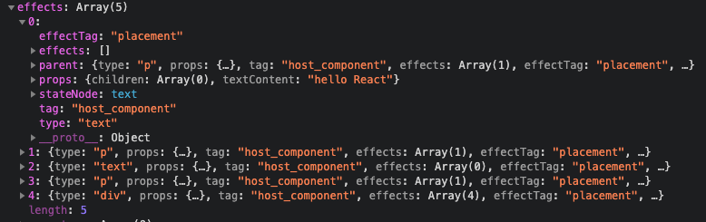

# 一、概述

获取到最外层节点的 fiber 对象，就可以获取到存储 fiber 对象的数组。当 executeTask 方法中的 while 循环执行完成之后，currentExecutelyFiber 这个变量存储的就是最外层节点的 fiber 对象。拿到存储 fiber 对象的数组后，就需要进入 fiber 算法的第二个阶段：实现初始渲染。在 fiber 算法的第二个阶段中，要做真实的 dom 操作，要去构建 dom 节点之间的关系，构建完成之后，要把真实的 dom 节点添加到页面中。

在进入 fiber 算法的第二个阶段之前，需要将 currentExecutelyFiber 变成全局变量。

# 二、更新代码

```javascript
// reconciliation.js
+  let pendingCommit = null;

// 执行fiber第二阶段的方法
+   const commitAllWork = (fiber) => {
+   console.log(fiber.effects);
+   fiber.effects.forEach((item) => {
+       if (item.effectTag === "placement") {
+       item.parent.stateNode.appendChild(item.stateNode);
+       }
+   });
    };

    const executeTask = (fiber) => {
        while(){...}
+       pendingCommit = currentExecutelyFiber;
    }

    const workLoop = (deadline) => {
        ...
+       if (pendingCommit) {
+           commitAllWork(pendingCommit);
+       }
    };
```

更新之后，jsx 就可以显示在页面上了。其中，commitAllWork 方法接收的参数 fiber.effects 打印出来如下图：


# 三、完整代码

```javascript
import { createTaskQueue, arrified, createStateNode, getTag } from "../Misc";

const taskQueue = createTaskQueue();
// 默认没有任务
let subTask = null;
let pendingCommit = null;

// 执行fiber第二阶段的方法
const commitAllWork = (fiber) => {
  console.log(fiber);
  fiber.effects.forEach((item) => {
    if (item.effectTag === "placement") {
      item.parent.stateNode.appendChild(item.stateNode);
    }
  });
};
const getFirstTask = () => {
  // 从任务队列中获取任务
  const task = taskQueue.pop();
  // 返回最外层节点的fiber对象
  return {
    props: task.props,
    stateNode: task.dom,
    tag: "host_root",
    effects: [],
    child: null,
  };
};
const reconcileChildren = (fiber, children) => {
  // 1.children可能是对象也可能是数组。需要将children转换成数组
  const arrifiedChildren = arrified(children);
  // 2.拿到数组中的vdom，转成fiber
  let index = 0;
  let numberOfElements = arrifiedChildren.length;
  let element = null;
  let newFiber = null;
  let prevFiber = null;
  while (index < numberOfElements) {
    element = arrifiedChildren[index];
    newFiber = {
      type: element.type,
      props: element.props,
      tag: getTag(element),
      effects: [],
      effectTag: "placement",
      parent: fiber,
    };

    newFiber.stateNode = createStateNode(newFiber);
    // 为父级fiber添加子级fiber
    if (index == 0) {
      fiber.child = newFiber;
    } else {
      prevFiber.sibling = newFiber;
    }
    prevFiber = newFiber;
    index++;
  }
};
const executeTask = (fiber) => {
  reconcileChildren(fiber, fiber.props.children);

  // 如果有子级，就返回子级，将这个子级当作父级，构建这个父级下的子级
  if (fiber.child) {
    return fiber.child;
  }

  let currentExecutelyFiber = fiber;

  // 没有子级，就判断是否有同级，有同级直接返回同级，没有同级就退到其父级，判断父级是否有同级
  while (currentExecutelyFiber.parent) {
    currentExecutelyFiber.parent.effects =
      currentExecutelyFiber.parent.effects.concat(
        currentExecutelyFiber.effects.concat([currentExecutelyFiber])
      );
    if (currentExecutelyFiber.sibling) {
      return currentExecutelyFiber.sibling;
    }
    currentExecutelyFiber = currentExecutelyFiber.parent;
  }

  pendingCommit = currentExecutelyFiber;
  console.log(fiber);
};
const workLoop = (deadline) => {
  // 1.先判断任务是否存在，如果不存在，则调用getFirstTask获取任务
  if (!subTask) {
    subTask = getFirstTask();
  }

  // 2.如果任务存在并且浏览器空余时间，则调用executeTask执行任务subTask
  // executeTask会返回一个新的任务
  while (subTask && deadline.timeRemaining() > 1) {
    subTask = executeTask(subTask);
  }

  if (pendingCommit) {
    commitAllWork(pendingCommit);
  }
};
// performTask函数通过形参获得浏览器的空闲时间
// 此方法不负责执行任务，只负责调度任务
const performTask = (deadline) => {
  // 执行任务
  workLoop(deadline);
  // 如果任务在执行过程中有更高优先级的任务要处理，那么这个任务就会被打断，任务打断，workLoop方法就会退出，就会执行本行下面的逻辑

  // 判断subTask任务是否有值
  // 判断任务队列中是否还有任务没有执行
  // 再次告诉浏览器在空闲的时间执行任务
  if (subTask || taskQueue.isEmpty()) {
    requestIdleCallback(performTask);
  }
};
// dom是父级
export const render = (element, dom) => {
  // 1.向任务队列中添加任务
  // 2.指定在浏览器空闲时执行任务
  // 任务就是通过vdom对象构建fiber对象
  taskQueue.push({
    dom,
    props: { children: element },
  });
  // 当浏览器空闲时就会调用performTask
  requestIdleCallback(performTask);
};
```
