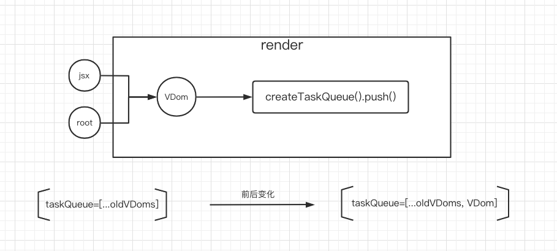

# 一、文件结构

| 文件/文件夹                             | 描述                                                                                                            |
| --------------------------------------- | --------------------------------------------------------------------------------------------------------------- |
| src/react/Misc                          | Misc 是一些杂项功能的集合文件夹                                                                                 |
| src/react/Misc/CreateTaskQueue/index.js | 创建任务队列（任务就是通过 vdom 对象创建 fiber 对象），暴露出 pop 和 push 方法，即向任务队列中添加或获取任务    |
| src/react/Misc/reconciliation/index.js  | 定义了 render 方法，render 将接收到的 jsx，root 转化成一个 vdom 对象，并调用 createTaskQueue().push(vdom)方法。 |
| src/react/createElement.js              | 将组件或者元素转成 ReactElement                                                                                 |
| src/index.js                            | 定义 root,以及 jsx，调用 render 方法                                                                            |

# 二、简易的流程图



# 三、实现思路

1、在入口文件 src/index.js 中准备一段 jsx 代码，需要实现的是，利用 fiber 算法将这段 jsx 转换成 dom 对象显示在页面上。首先，这段 jsx 会被 babel 转化成 React.createElement 方法的调用。

2、编写 createElement 方法，并作为 React 的外部方法导出。

3、创建辅助方法 creteTaskQueue，因为执行的任务有很多，所以需要创建一个任务队列，在执行任务之前都需要将其放在任务队列中，方便 fiber 算法内部调动。creteTaskQueue 方法返回了两个方法：push-向任务队列中添加任务、pop-从任务队列中获取任务。

4、reconciliation 文件夹放置了 fiber 算法的核心逻辑，在 reconciliation 方法中定义了 render 方法，并导出，这样在入口文件 src/index.js 就可以使用 render 方法。

5、render 方法主要实现两个事：向任务队列中添加任务；指定在浏览器空闲时执行任务。render 方法接收两个参数：element（子）、dom（父），需要在元素的最顶层向下查找，查找到每个元素的 vdom，为每个 vdom 创建 fiber 对象。render 方法调用了 creteTaskQueue 方法，创建了一个任务队列，向队列中添加任务（就是一个包含了父子级的对象）。

# 四、核心代码

```javascript
// 入口文件src/index.js
import React, { render } from "./react";
const root = document.getElementById("root");
const jsx = (
  <div>
    <p>hello React</p>
  </div>
);

render(jsx, root);
```

```javascript
//src/react/createElement.js
export default function createElement(type, props, ...children) {
  const childElements = [].concat(...children).reduce((result, child) => {
    if (child !== false && child !== true && child !== null) {
      if (child instanceof Object) {
        result.push(child);
      } else {
        result.push(createElement("text", { textContent: child }));
      }
    }
    return result;
  }, []);
  return {
    type,
    props: Object.assign({ children: childElements }, props),
  };
}
```

```javascript
//src/react/Misc/reconciliation/index.js
import { createTaskQueue } from "../Misc";

const taskQueue = createTaskQueue();

// dom是父级
export const render = (element, dom) => {
  // 1.向任务队列中添加任务
  // 2.指定在浏览器空闲时执行任务

  // 任务就是通过vdom对象构建fiber对象
  taskQueue.push({
    dom,
    props: { children: element },
  });
  console.log(taskQueue.pop());
};
```

```javascript
//src/react/Misc/CreateTaskQueue/index.js
// 创建任务队列
const createTaskQueue = () => {
  const taskQueue = [];
  return {
    // 向任务队列中添加任务
    push: (item) => taskQueue.push(item),
    // 从任务队列中获取任务
    pop: () => taskQueue.shift(),
  };
};

export default createTaskQueue;
```
