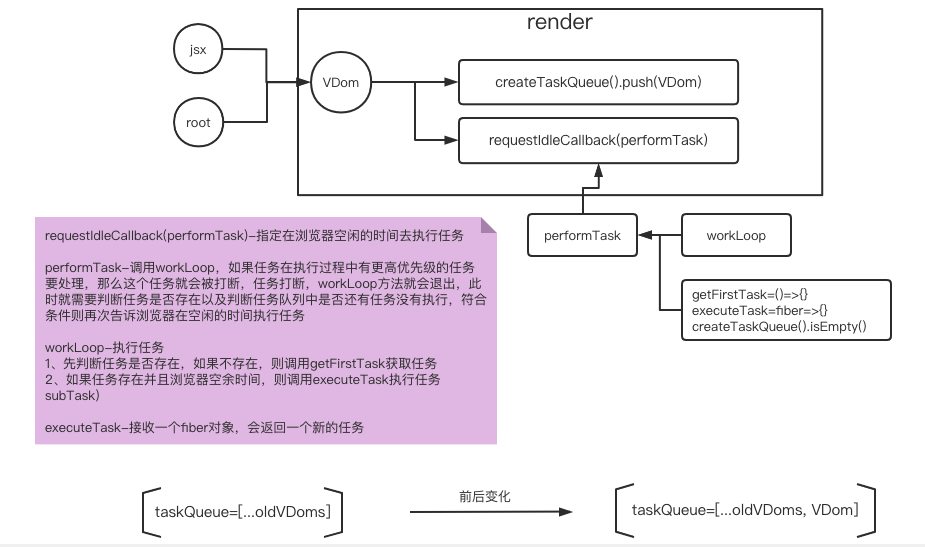

# 一、实现思路

上一步骤，在 render 方法中已经实现了向任务队列中添加任务，本节在 render 方法中实现“指定在浏览器空闲时执行任务”的逻辑。

1、在 render 方法中向任务队列中添加任务之后，调用 requestIdleCallback，传入的参数是一个函数（performTask），当浏览器空闲时就会调用这个函数。

2、在 performTask 函数中，先调用 workLoop 函数以执行任务。
在任务执行过程中，有更高优先级的任务要执行，当前的任务就会被打断，workLoop 方法就会退出，此时就需要重新注册任务，判断 subTask 任务是否有值或任务队列里是否还有任务，如果还有任务就再次告诉浏览器在空闲的时间执行任务。

# 二、简易的流程图



# 三、核心代码

1、在 createTaskQueue 方法中新增“判断任务队列中是否还有任务”方法

```javascript
// CreateTaskQueue/index.js
const createTaskQueue = () => {
  return {
    ...
    // 判断任务队列中是否还有任务
    isEmpty: () => taskQueue.length === 0
  };
};

export default createTaskQueue;
```

2、

```javascript
import { createTaskQueue } from "../Misc";

const taskQueue = createTaskQueue();
// 默认没有任务
const subTask = null;
const getFirstTask = () => {};
const executeTask = (fiber) => {};
const workLoop = (deadline) => {
  // 1.先判断任务是否存在，如果不存在，则调用getFirstTask获取任务(如果子任务不存在，就去获取子任务)
  if (!subTask) {
    subTask = getFirstTask();
  }

  // 2.如果任务存在并且浏览器空余时间，则调用executeTask执行任务subTask
  // executeTask会返回一个新的任务
  while (subTask && deadline.timeRemaining() > 1) {
    subTask = executeTask(subTask);
  }
};
// performTask函数通过形参获得浏览器的空闲时间
// 此方法不负责执行任务，只负责调度任务
const performTask = (deadline) => {
  // 执行任务
  workLoop(deadline);
  // 如果任务在执行过程中有更高优先级的任务要处理，那么这个任务就会被打断，任务打断，workLoop方法就会退出，就会执行本行下面的逻辑

  // 判断subTask任务是否有值
  // 判断任务队列中是否还有任务没有执行
  // 再次告诉浏览器在空闲的时间执行任务
  if (subTask || taskQueue.isEmpty()) {
    requestIdleCallback(performTask);
  }
};
// dom是父级
export const render = (element, dom) => {
  // 1.向任务队列中添加任务
  // 2.指定在浏览器空闲时执行任务

  // 任务就是通过vdom对象构建fiber对象
  taskQueue.push({
    dom,
    props: { children: element },
  });
  // 当浏览器空闲时就会调用performTask
  requestIdleCallback(performTask);
};
```
